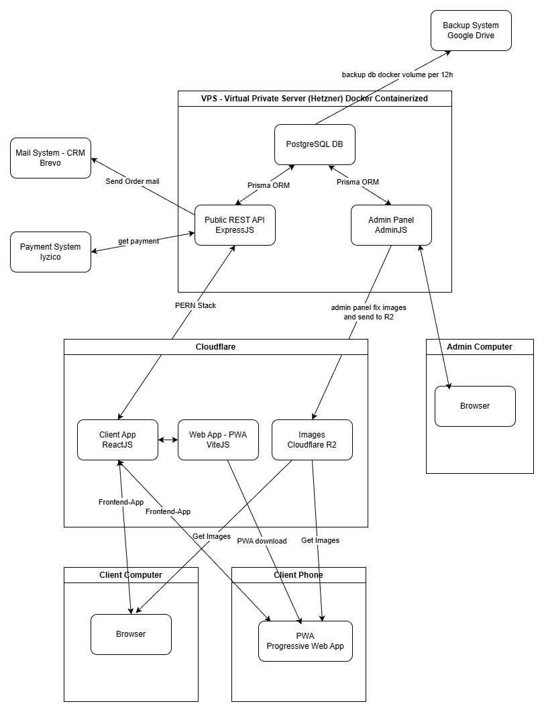
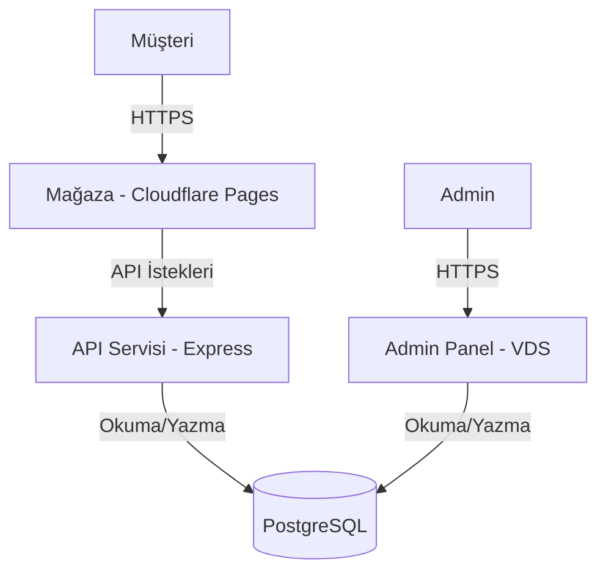

# Sistem Mimarisi

Uygulama, Docker üzerinde çalışan **Mikroservis tabanlı bir Mimari** benimser. Ayrım, ölçeklenebilirlik ve kolay dağıtım sağlar.

## Genel Bakış

## Servisler

### 1. API Servisi (`/server/api`)
- **Rol**: Mağaza için public REST API
- **Port**: 8080
- **Sorumluluk**: Ürün listeleme, sepet hesaplama, misafir checkout
- **Tasarım Paterni**: MSC (Model-Service-Controller) Architecture (SOLID)
    - **Controllers**: HTTP request/response yönetimi
    - **Services**: İş mantığı (örn: `OrderService`)
    - **Repositories**: Veri erişim katmanı (Prisma)
- **Güvenlik**: Mağaza endpoint'leri için authentication gerekmez

### 2. Admin Servisi (`/server/admin`)
- **Rol**: Personel için dahili Backoffice
- **Port**: 8081
- **Sorumluluk**: Ürün, sipariş, kullanıcı yönetimi (CRUD)
- **Teknoloji**: AdminJS + `@adminjs/prisma`
- **Güvenlik**: Session tabanlı authentication (`express-session`, `connect-pg-simple`)
- **Tasarım**: Modüler yapılandırma (`src/config/resources.js`, `src/config/auth.js`) - SRP uyumlu

### 3. Veritabanı Servisi (`db`)
- **Rol**: Paylaşımlı persistence katmanı
- **Teknoloji**: PostgreSQL 15
- **Şema**: API ve Admin servisleri tarafından paylaşılan tek şema

### 4. Client Servisi (`/client`)
- **Rol**: Frontend Mağaza
- **Teknoloji**: React, Vite, Tailwind CSS, PWA
- **Dağıtım**: Cloudflare Pages
- **İletişim**: API'ye HTTPS üzerinden istek yapar

## Tasarım Prensipleri (SOLID)

- **Single Responsibility**: Her servis (API vs Admin) tek bir odağa sahip. API içinde sınıflar (Service/Repo) ayrı görevlere sahip.
- **Open/Closed**: `BaseRepository` değiştirilmeden genişletilebilir. `Container.js` implementasyonların değiştirilmesine izin verir (DI).
- **DependencParam Integration**: Controller'lar soyutlamalara (inject edilen Service'ler) bağlıdır, somut implementasyonlara değil.

## Güvenlik Mimarisi

Bu mimari, geleneksel monolitik risklerden "Derinlemesine Savunma" stratejisine geçiş yapar:

### 1. Cloudflare: Dış Savunma & Origin Gizleme
Trafik sunucuya ulaşmadan önce kalkan görevi görür:
- **IP Gizleme**: Saldırganlar sadece Cloudflare'ın Edge IP'lerini görür. Origin sunucu (VDS) gizli kalır.
- **WAF & DDoS Koruması**: Kötü niyetli botlar ve yaygın güvenlik açıkları (SQLi, XSS) Cloudflare WAF tarafından filtrelenir.

### 2. Konteyner İzolasyonu (Sandboxing)
Servisler izole Docker container'larında çalışır:
- **Hasar Kontrolü**: API container'ı ele geçirilse bile, saldırgan o runtime'da hapsolur. Host OS'a veya diğer container'lara erişemez.
- **Minimum Yetki**: Container'lar sadece uygulamayı çalıştırmak için gereken binary'leri içerir.

### 3. Prisma ORM: SQL Injection Bağışıklığı
- **Parametreli Sorgular**: Prisma ORM kullanarak tüm veritabanı girdileri otomatik olarak sanitize edilir.

### 4. Cloudflare R2: Güvenli Varlık Depolama
Kullanıcı yüklemelerini Object Storage'a (R2) yükleyerek:
- **RCE Önleme**: Web Shell saldırıları engelenir çünkü dosyalar R2'de saklanır, sunucu diskinde değil.
- **Erişim Kontrolü**: Sunucu üzerinde karmaşık dosya izni yönetimi gereksiz olur.

### 5. Dışsallaştırılmış Hassas Operasyonlar
- **Payment Gateway**: Param (SOAP/WSDL))**: Kredi kartı verileri doğrudan Ödeme Gateway'inin iframe'ine girer. Ham kart verisi backend'e **asla** ulaşmaz.
- **E-posta Güvenliği (Brevo)**: Harici SMTP sağlayıcı kullanarak sunucu IP'sinin spam listesine girmesi önlenir.

### 6. Felaket Kurtarma & Ransomware Koruması
- **Offsite Yedekleme**: Otomatik cron job, şifreli Docker Volume snapshot'larını **Google Drive**'a gönderir.
- **Dayanıklılık**: Katastrofik durumda (donanım arızası veya VPS'in ransomware ile şifrelenmesi) iş operasyonları harici yedekten minimal veri kaybıyla geri yüklenebilir.

## Cloudflare Tunnel (Aktif)

Zero Trust Network için **Cloudflare Tunnel** implementasyonu tamamlandı:

### Özellikler
- **Port Kapatma**: VDS'de standart portlar (80, 443) public internet'e kapalı. API sadece `localhost`'ta çalışır.
- **Anti-tarama**: Açık port olmadığı için Shodan, Nmap gibi tarayıcılardan "fırsatçı" saldırılar engellenir.

### Implementasyon
- **Cloudflared Container**: Docker network içinde hafif daemon (`cloudflared`) çalışır. Cloudflare Edge'e güvenli outbound bağlantı kurar.
- **Firewall Kuralları**: UFW tüm inbound trafiği engeller, sadece SSH (özel port üzerinden) izin verilir.

### Avantajlar
- **DDoS Bağışıklığı**: Origin sunucu tunnel dışı tüm trafiği reddeder, doğrudan IP saldırıları imkansız olur.
- **Bot & Scraper Kontrolü**: Rakiplerin hassas fiyat verilerini scrape'lemesi engellenir.
- **Zero Trust Admin Erişimi**: Admin Panel Cloudflare Access arkasına alınabilir, login sayfasına bile ulaşmadan SSO katmanı eklenebilir.

## Caddy Reverse Proxy (Aktif)

Nginx yerine **Caddy** kullanılmaktadır:

### Özellikler
- **Otomatik HTTPS**: Let's Encrypt sertifikaları otomatik alınır ve yenilenir.
- **Basit Konfigürasyon**: Reverse proxy ayarı Nginx'e göre çok daha basit.
- **HTTP/3 (QUIC)**: Görsel ağırlıklı e-ticaret trafiği için üstün performans.
- **Bellek Güvenliği**: Go ile yazılan Caddy, C tabanlı sunuculara göre buffer overflow'a karşı dirençlidir.
