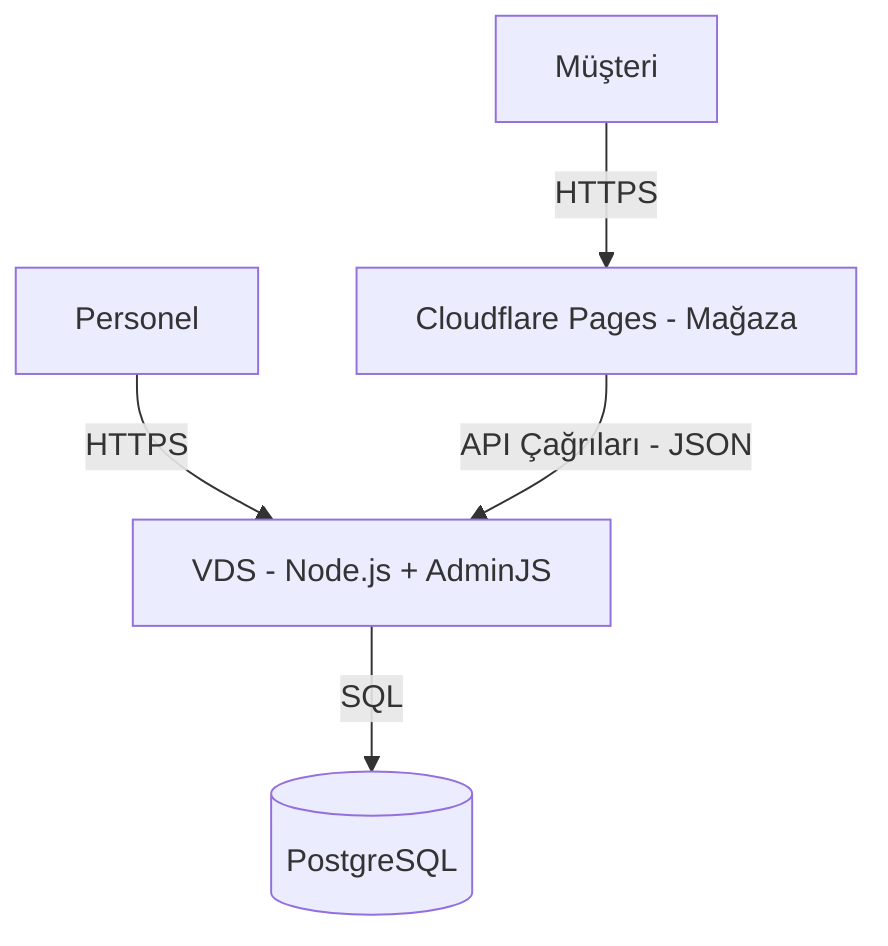

# Dağıtım Stratejisi

Uygulama, farklı ölçekleme ve güvenlik gereksinimleri için tasarlanmış **Ayrık Mimari** kullanır.

## 1. Müşteri Mağazası (Cloudflare Pages)
- **Rol**: Public e-ticaret sitesi
- **Barındırma**: Cloudflare Edge Network
- **Teknoloji**: React (Vite), Tailwind CSS, PWA
- **Erişim**: Public / Misafir
- **Özellikler**:
  - Yüksek performanslı statik varlık dağıtımı
  - Ürün tarama, Arama, Sepet
  - Misafir Checkout (API üzerinden)
- **Güvenlik**: Bundle'da yönetici yetenekleri veya mantığı yok

## 2. Backend & Admin Panel (VDS)
- **Rol**: API Sunucusu ve Dahili Backoffice
- **Barındırma**: Docker üzerinden VDS
- **Teknoloji**: Node.js, Express, AdminJS, PostgreSQL (Prisma)
- **Erişim**:
  - **API**: Mağaza için public erişilebilir endpoint'ler (`/api/v1`)
  - **Admin Panel**: Sadece personel için kısıtlı erişim (`/admin`)
- **Özellikler**:
  - Veritabanı yönetimi
  - Sipariş işleme ve durum güncellemeleri
  - Üçüncü taraf entegrasyonları (Iyzico, Brevo)

## Diyagram



## Trafik Akışı

### Müşteri Trafiği
```
Müşteri → Cloudflare CDN → Static Files (React App)
                ↓
         API İstekleri → Cloudflare Tunnel → VDS API
```

### Admin Trafiği
```
Admin → Cloudflare Access (SSO) → Cloudflare Tunnel → VDS Admin Panel
```

## Güvenlik Katmanları

1. **Cloudflare WAF**: DDoS, bot filtreleme
2. **Cloudflare Access**: Admin için SSO
3. **Cloudflare Tunnel**: Origin gizleme
4. **Docker İzolasyonu**: Container sandboxing
5. **Prisma ORM**: SQL injection koruması

## CI/CD Pipeline (Önerilen)

```yaml
# GitHub Actions örneği
name: Deploy

on:
  push:
    branches: [main]

jobs:
  deploy-client:
    runs-on: ubuntu-latest
    steps:
      - uses: actions/checkout@v3
      - run: cd client && npm ci && npm run build
      - uses: cloudflare/pages-action@v1
        with:
          projectName: nalburdeposu
          directory: client/dist

  deploy-server:
    runs-on: ubuntu-latest
    steps:
      - uses: appleboy/ssh-action@v1
        with:
          host: ${{ secrets.VDS_HOST }}
          username: ${{ secrets.VDS_USER }}
          key: ${{ secrets.VDS_KEY }}
          script: |
            cd /opt/nalburdeposu/server
            git pull
            docker-compose up --build -d
```

## Yedekleme Stratejisi

- **Veritabanı**: Günlük pg_dump → Google Drive
- **Docker Volumes**: 12 saatte bir snapshot → Google Drive
- **Kod**: GitHub repository
